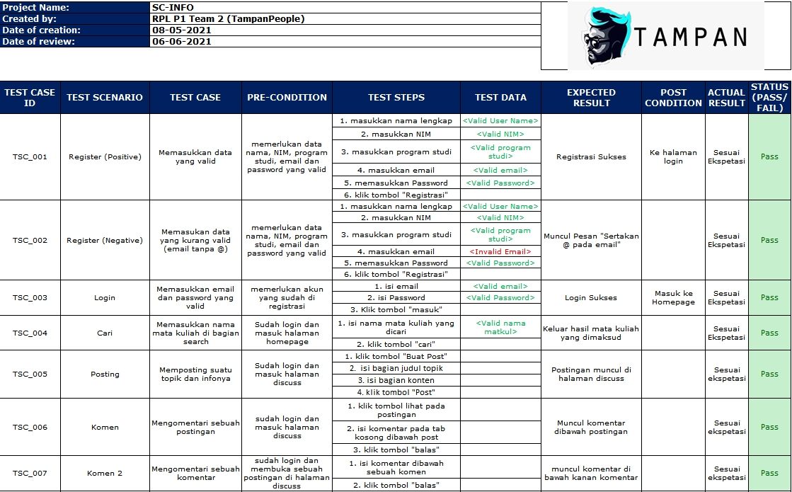

 

  
  <h3 align="center">SC-INFO</h3>

  

    Paralel 1 Kelompok 2 (Asisten Praktikum: Indah Puspita dan Qoriatul Khairunnisa)
  

  
 Asprak : Indah Puspita, Qoriatul Khairunnisa 

<!-- TABLE OF CONTENTS -->

<h2 style="display: inline-block">Nama Anggota</h2>

<ol>
  <li>Arhammirza Ibrahim (G64190007) -> Ketua, Fullstack Developer </li>
  <li>Aryo Aditya (G64190008) -> Backend Devloper </li>
  <li>Sigit Raditya Pangestu (G64190071) -> Frontend Developer </li>
  <li>Yosar Awandi Porseda (G64190076) -> Quality Assurance</li>
</ol>

<!-- ABOUT THE PROJECT -->
## Deskripsi Singkat Aplikasi
SC-Info adalah aplikasi berbasis web yang berguna untuk memudahkan
mahasiswa mendapatkan informasi terkait mata kuliah supporting course. Aplikasi ini
memiliki fitur ....(fiturnya yg jadi apa aja bro?).

## User Analysis
### User Story
* Sebagai seorang mahasiswa yang sedang mencari informasi lengkap mata kuliah SC, agar dapat masuk ke laman web SC Info, saya dapat login terlebih dahulu.
* Sebagai seorang mahasiswa, agar dapat menemukan matkul sc dengan mudah, saya dapat menggunakan fitur search SC
* Sebagai seorang mahasiswa, agar bisa menyimpan matkul sc tsb berupa list, saya dapat menekan tombol "Plan" pada sc tersebut
* Sebagai mahasiswa, agar dapat mencari mata kuliah yang cocok untuk dimasukkan ke dalam krs, saya dapat masuk ke menu rekomendasi SC
* Sebagai mahasiswa, agar dapat berdiskusi mengenai sc dengan pengguna lainnya, saya dapat menggunakan fitur diskusi

## Spesifikasi teknis lingkungan pengembangan
### Software
* Framework : Laravel dan Boostrap
* Database : MySQL
* Server : Apache
* Text Editor : Visual Studio Code
### Hardware
* Processor : Intel(R) Core(TM) i5-3230M CPU @ 2.60GHz 2.60 GHz
* Graphics Card : Intel HD 4000 Graphic
* RAM : 8 GB
### Tech Stack
-Html, CSS, Javascript, PHP, MySQL

## Hasil dan pembahasan
### 1. Use Case Diagram
 

  
  
Use Case Diagram

### 2. Activity Diagram
 

  
  
Activity Diagram

### 3. Class Diagram
 

  
  
Class Diagram

### 4. Entity Relationship Diagram
 

  
  
ERD

### 5. Arsitektur sistem
 

  
  
Arsitektur diagram

### 6. Fungsi utama yang dikembangkan
* Cari    : Mencari mata kuliah berdasarkan nama
* Posting : Memposting sebuah topik di halaman discuss
* Komen   : Mengomentari sebuah postingan
### 7. Fungsi CRUD
1. Akun
  * Create  : User dapat membuat akun baru
  * Read    : Web dapat mengambil data dari user saat register atau edit profile
  * Update  : User dapat mengganti data dari akun
  * Delete  : Admin dapat menghapus data user
2. Mata Kuliah
  * Create  : Admin dapat membuat data matkul baru
  * Read    : Web dapat mengambil data mata kuliah sehingga user dapat mencari mata kuliah melalui fitur search
  * Update  : Admin dapat membuat perubahan pada data mata kuliah
  * Delete  : Admin dapat menghapus data mata kuliah
## Hasil implementasi
### Screenshot sistem
 

  
  
  
  
Screenshot

### Link aplikasi
-http://infosc.epizy.com/

## Testing (Test cases)
 

  
  
Testcase

## Saran untuk pengembangan selanjutnya
-Memperbaiki tampilan dan menambahkan fitur-fitur di web, terutama fitur plan.
